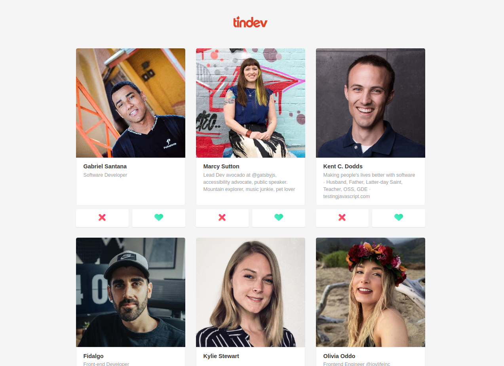

<div align="center">
  
</div>

#####



<p align="center">A Tinder clone that makes matches between developers 🔥</p>

## 🛠️ Technologies

<ul>
  <li><a href="https://nodejs.org/en/">Node.js</a></li>
  <li><a href="https://expressjs.com/">Express</a></li>
  <li><a href="https://reactjs.org/">React</a></li>
  <li><a href="https://reactnative.dev/">React Native</a></li>
  <li><a href="https://expo.io/">Expo</a></li>
  <li><a href="https://www.mongodb.com/">MongoDB</a></li>
  <li><a href="https://mongoosejs.com/">Mongoose</a></li>
  <li><a href="https://socket.io/">Socket.io</a></li>
</ul>

## ⚙️ Requirements

<ul>
  <li><a href="https://git-scm.com/">Git</a></li>
  <li><a href="https://nodejs.org/en/">Node.js</a></li>
  <li><a href="https://www.npmjs.com/">NPM</a></li>
  <li><a href="https://expo.io/">Expo</a></li>
  <li><a href="https://expo.io/">Expo CLI</a></li>
  <li><a href="https://www.mongodb.com/cloud/atlas">MongoDB Atlas Cluster</a></li>
</ul>

## 🚀 Installation

```bash
$ git clone https://github.com/gabrielsanttana/tindev
```

### 🗄️ API

Before running the API, it's necessary to have a database setup on a MongoDB Atlas Cluster. With that, create a `.env` file in the backend folder root and put these keys in environment variables and they'll work on the mongoose connection string.

Example:

```
MONGODB_USERNAME=username
MONGODB_PASSWORD=123456
MONGODB_CLUSTER_URL=cluster0-lfmbb.mongodb.net
```

If you prefer, you can just place your connection string on the `server.js` file:

```
mongoose.connect(`mongodb+srv...`);
```

Then:

```bash
$ cd tindev/backend
$ npm install
$ npm run dev
```

The API will start serving on http://localhost:3333

> Note: It's important to have the API running to be able to properly run the web and mobile app

### 💻 Web

```bash
$ cd tindev/frontend
$ npm install
$ npm start
```

The application will pop-up in the browser on http://localhost:3000

### 📱 Mobile

🚧 Under construction 🚧

## ⚖️ License

[MIT License](https://github.com/gabrielsanttana/tindev/blob/master/LICENSE)
